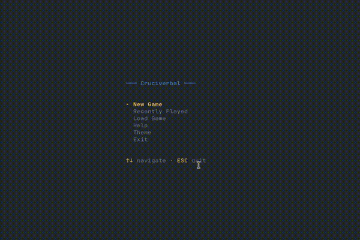

# Cruciverbal

<!--
to convert screen-recording to optimized gif:

ffmpeg -i demo.mov -s 600x400 -pix_fmt rgb24 -r 10 -f gif - | gifsicle --optimize=3 --delay=3 > demo.gif
-->



A terminal-based crossword puzzle player written in Rust. Solve crosswords puzzles from various providers directly in your terminal.

- [x] **Puzzles** from _Guardian_, _Washington Post_, _USA Today_, and more
- [x] **Interactive TUI** with keyboard navigation and word highlighting
- [x] **Timer & Completion tracking** with win detection
- [x] **Reveal functionality** for hints (letter, word, or full puzzle)
- [x] **Auto-saves** that are wiped after a week

| Provider                                                        | Variants                                                  |
| --------------------------------------------------------------- | --------------------------------------------------------- |
| [Lovatts](./providers/src/providers/lovatts_cryptic.rs)         | Cryptic                                                   |
| [The Guardian](./providers/src/providers/guardian.rs)           | Cryptic, Everyman, Speedy, Quick, Prize, Weekend, Quiptic |
| [Washington Post](./providers/src/providers/washington_post.rs) | Sunday                                                    |
| [USA Today](./providers/src/providers/usa_today.rs)             | Daily                                                     |
| [Simply Daily](./providers/src/providers/simply_daily.rs)       | Regular, Cryptic, Quick                                   |
| [Universal](./providers/src/providers/universal.rs)             | Daily                                                     |
| [Daily Pop](./providers/src/providers/daily_pop.rs)             | Daily                                                     |

## Installation

Install `cruciverbal` with:

```bash
cargo install --git https://github.com/erhant/cruciverbal.git
```

### From Source

Alternatively, build the crates locally:

```bash
git clone https://github.com/erhant/cruciverbal.git
cd cruciverbal
cargo build --release
```

The binary will be at `target/release/cruciverbal`.

## Usage

Run the application:

```bash
cruciverbal
```

Alternatively, if built from source:

```bash
cargo run
```

- Once `cruciverbal` starts, at the main menu, you can select <kbd>New Game</kbd> and select a date & provider to start a new game. All recently played games will be shown at <kbd>Recently Played</kbd>.

- You can save a game with <kbd>CTRL+S</kbd> while playing a game, and you can continue from that save at <kbd>Load Game</kbd> menu.

- There are some handy commands while playing, such as navigation & letter reveals, you can see them with <kbd>CTRL+H</kbd> or the <kbd>Help</kbd> menu.

- You can change the color theme from <kbd>Theme</kbd> menu.

Enjoy!

## References

The repositories below have been of great help to the development of this project:

- [thisisparker/xword-dl](https://github.com/thisisparker/xword-dl)
- [thisisparker/cursewords](https://github.com/thisisparker/cursewords)
- [apexatoll/cliptic](https://github.com/apexatoll/cliptic)

## License

[MIT](./LICENSE)
